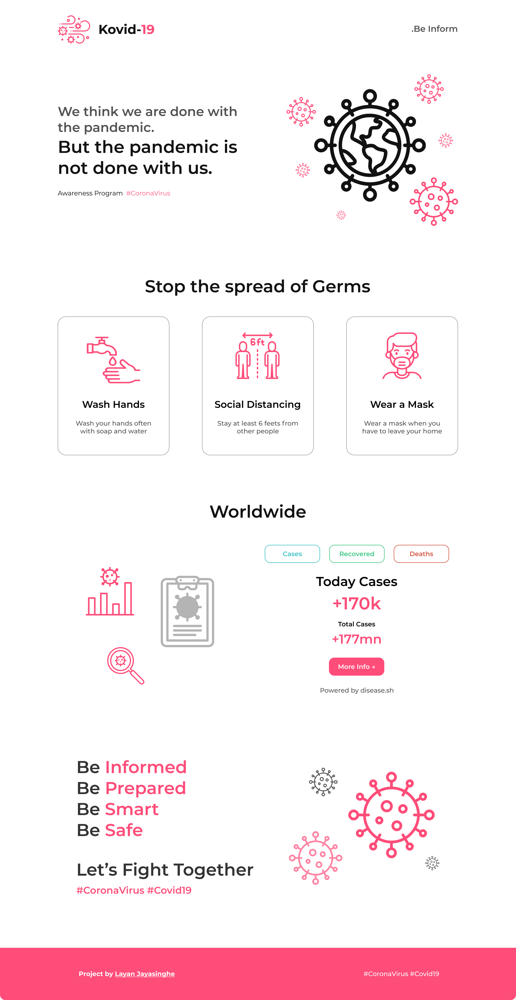
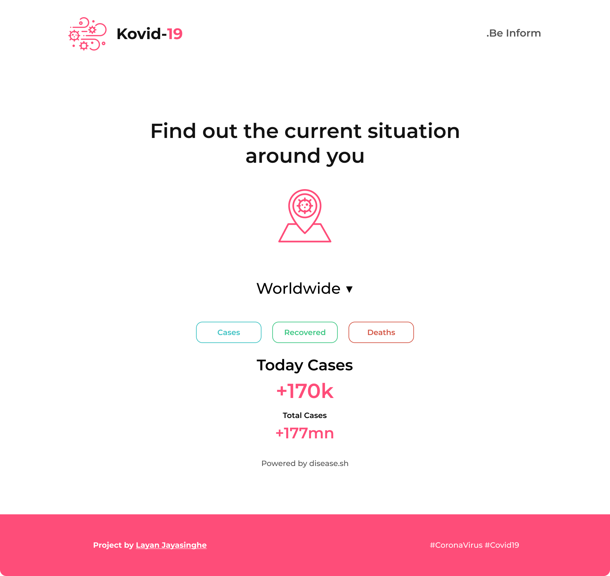

# Kovid-19

## Introduction

Kovid-19 is an awareness program built to spread the word to be safe and be informed of the correct data around the globe. #Coronavirus #Covid-19.

With this web application, users can easily find out the data which related to Covid-19 pandemic situation.

## Tech Stack

- Nextjs
- Tailwindcss
- vercel
- desease.sh (API)

## Screenshots

    

NOTE: The previously built Covid-19 tracker is now deprecated and no longer maintained.
